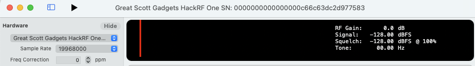
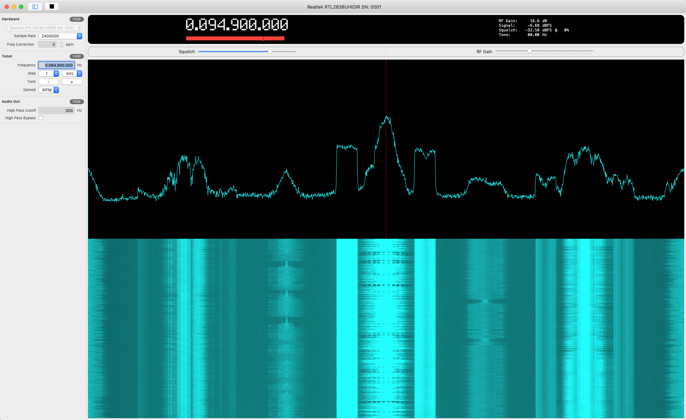

# waveSDR

A macOS native desktop Software Defined Radio application using the RTL-SDR USB device.

<>Aug 2026<>

So.... as it turns out, there have been some significant changes to some of Apple's APIs that are used in waveSDR and when doing a simple build / run from Sequoia, it does not work as it used to and seems to constantly crash from one of my calls into DispatchQueue.  I am going through the code and API to find out what I am doing incorrectly and will hopefully have a fully working build sometime soon.

At the same time, I am currently developing a hardware (MCU) independent driver for a HopeRF transceiver module that uses FSK modulation.  As soon as I get my driver in a stable state, I plan on implementing a FSK decoder such that I can debug my wireless transmisions / protocols.   

<> Jun 2026 <>

Not sure if anybody is still following this project as I have left it on the back burner, so to speak, for way to long.  I plan on jumping back in and adding features.  The first feature I am working on is adding support for the HackRF One SDR radio.

<> Mar 2020<>

Back from a bit of a hiatus in development on waveSDR, but before I start adding features to waveSDR, I plan on finishing my port of librtlsdr to a native macOS Swift framework.  Follow the progress here: [RTLSDR.Swift](https://github.com/getoffmyhack/RTLSDR.Swift) 

<> May 2019 <>
 
I have started a simple build log which can be found in the project's root directory, more as notes to myself, but also as a means of thinking through my design choices and documenting them for future reference.  Eventually my build log will become posts on my wordpress site. 

At some future date I am going to migrate my domain name and all my web presence to a wordpress site.  I have no idea as to when I will finish as dealing with my web presence never seems to be a high priority.  In the mean time, if you wish to contact me about waveSDR, please feel free to [drop me a comment here.](https://getoffmyhack.wordpress.com/contact/) (Sorry for the wordpress template, I  prefer to write waveSDR code then build a wordpress site.)

If you are interested in my first prototype / proof-of-concept design, check out my [first Youtube video.](https://youtu.be/aE4_K-NDLcQ)  I also plan on putting together simple videos demonstrating the new features as I add them to waveSDR.

<><>

**NB**:  This is purely experimental software.  I am using this application as a platform for teaching myself macOS desktop application programming as well as DSP techniques.  As it is, there are numerous sections of code where improvement is needed.

Features:

* RTL-SDR hardware
* Dynamic Device Detection
* Spectrum Analyzer
* Spectrogram
* AM Demodulator
* FM Narrow Demodulator
* FM Wide Demodulator (mono only)
* Mixer Tuning
* Swipe to tune
